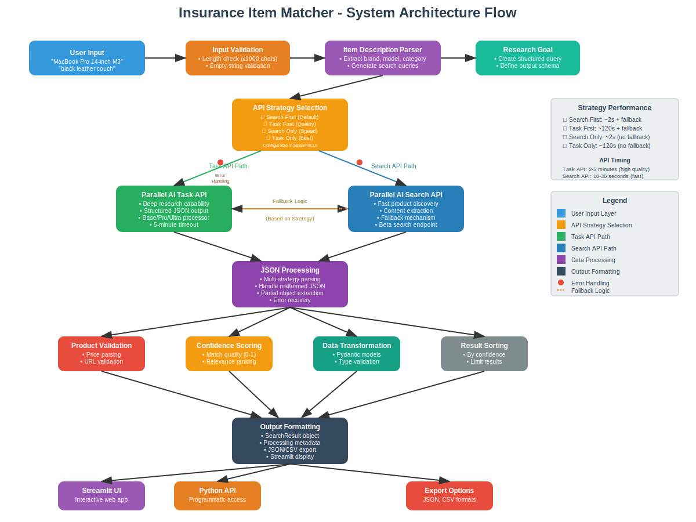

# Insurance Item Matcher

A well-structured and maintainable service that accepts free-text descriptions of lost or stolen items and returns the most closely matching products available online, along with their prices and direct product URLs.

This tool is designed for use by insurance companies to help determine reimbursement values for lost items by identifying suitable replacement products.

## Features

- 🔍 **Smart Item Parsing**: Automatically extracts brand, model, category, and specifications from item descriptions
- 🌐 **Web Product Search**: Uses Parallel AI's Task and Search APIs for comprehensive product discovery
- 💰 **Price Information**: Returns current market prices for insurance reimbursement calculations
- 🔗 **Direct Product URLs**: Provides direct links to purchase replacement products
- 📊 **Multiple Output Formats**: Support for table, JSON, and summary output formats
- 🛡️ **Robust Error Handling**: Comprehensive error handling and fallback mechanisms
- 📈 **Confidence Scoring**: Match confidence scores to help assess result quality
- 🎯 **Flexible Input**: Handles both detailed ("iPhone 16 Pro Max model XYZ123") and vague ("black couch") descriptions

## Installation

### Prerequisites

- Python 3.8 or higher
- Parallel AI API key

### Setup

1. **Clone or download the project**:
   ```bash
   git clone <repository_url>
   cd insurance-item-matcher
   ```

2. **Install dependencies**:
   ```bash
   pip install -r requirements.txt
   ```

3. **Set up your API key** (choose one method):
   
   **Option A: Environment Variable (Recommended)**
   ```bash
   export PARALLEL_AI_API_KEY="uhvDr1sW9RKu-NyRirCC2ivqpQiwHFtXseHeMFJB"
   ```
   
   **Option B: Command Line**
   ```bash
   python main.py search "your item" --api-key "uhvDr1sW9RKu-NyRirCC2ivqpQiwHFtXseHeMFJB"
   ```

## Usage

### Streamlit Web Interface

The service provides a user-friendly web interface built with Streamlit:

#### Launch the Web App

```bash
# Start the Streamlit application
streamlit run streamlit_app.py
```

This will open your browser to `http://localhost:8501` where you can:

- 🔍 **Search for products** using a simple text input
- ⚙️ **Configure settings** in the sidebar (API key, max results, processor type)
- 🎯 **Select API strategy** (Search First, Task First, Search Only, Task Only)
- 📊 **View results** in an organized card layout with prices and links
- 📈 **See performance metrics** including API timing and fallback behavior
- 📥 **Export data** to JSON or CSV formats
- 📚 **Access search history** for quick repeated searches
- 💡 **Get strategy recommendations** and usage tips

#### Web Interface Features

- **Real-time search** with progress indicators
- **API strategy selection** in sidebar (Search First, Task First, Search Only, Task Only)
- **Product cards** showing detailed information
- **Confidence scoring** with visual progress bars
- **Direct product links** for easy purchasing
- **Export capabilities** for further analysis
- **Search history** for convenience
- **Strategy recommendations** guide for optimal selection
- **Performance metrics** showing API timing and fallback behavior
- **Responsive design** that works on desktop and mobile

### Programmatic Usage

```python
from src import InsuranceItemMatcher

# Initialize the service
matcher = InsuranceItemMatcher()

# Search for matching products (default: search_first strategy)
result = matcher.find_matching_products(
    item_description="iPhone 16 Pro Max model XYZ123",
    max_results=5
)

# Access results
for product in result.matched_products:
    print(f"Product: {product.name}")
    print(f"Price: ${product.price}")
    print(f"URL: {product.url}")
    print(f"Confidence: {product.confidence_score:.1%}")
    print("---")
```

### API Strategy Options

The service now supports four different API strategies to optimize for speed vs quality based on your specific needs:

```python
# 🔄 Search API first with Task API fallback (DEFAULT - Recommended)
# Fast results (~2s) with high-quality fallback (~120s) when needed
result = matcher.find_matching_products(
    item_description="iPhone 14 Pro 256GB",
    api_strategy="search_first"  # Default
)

# 🎯 Task API first with Search API fallback 
# Highest quality first (~120s) with fast fallback (~2s) for broader coverage
result = matcher.find_matching_products(
    item_description="vintage leather sofa",
    api_strategy="task_first"
)

# ⚡ Search API only (fastest option)
# Maximum speed (~2s) with no fallback - good for quick searches
result = matcher.find_matching_products(
    item_description="Samsung Galaxy S23",
    api_strategy="search_only"
)

# 🚀 Task API only (highest quality)
# Best quality (~120s) with no fallback - for critical assessments
result = matcher.find_matching_products(
    item_description="professional camera equipment",
    api_strategy="task_only"
)
```

#### Strategy Selection Guide

| Strategy | Use Case | Speed | Quality | Best For |
|----------|----------|-------|---------|----------|
| `search_first` | **Most use cases** | ⚡⚡⚡ | ⭐⭐⭐ | General insurance claims, balanced needs |
| `task_first` | **High-value items** | ⚡ | ⭐⭐⭐⭐⭐ | Expensive electronics, luxury goods |
| `search_only` | **Quick estimates** | ⚡⚡⚡⚡⚡ | ⭐⭐ | Bulk processing, preliminary assessments |
| `task_only` | **Critical accuracy** | ⚡ | ⭐⭐⭐⭐⭐ | Legal cases, disputed claims |

#### Performance Comparison

```python
# Example timing results:
item = "MacBook Pro 14-inch M3"

# search_first: ~2.1s (Search API success, no fallback needed)
# task_first:  ~125.3s (Task API success, high-quality structured results)  
# search_only: ~1.8s (Search API only, fastest option)
# task_only:   ~128.7s (Task API only, maximum quality)
```

### Example Usage Script

Run the included programmatic example:
```bash
python main.py example
```

### Quick Start

Get started in 3 simple steps:

```bash
# 1. Install dependencies
pip install -r requirements.txt

# 2. Set your API key (optional - included in config)
export PARALLEL_AI_API_KEY="uhvDr1sW9RKu-NyRirCC2ivqpQiwHFtXseHeMFJB"

# 3. Launch the web interface
streamlit run streamlit_app.py
```

## API Reference

### InsuranceItemMatcher Class

#### `__init__(api_key: Optional[str] = None)`
Initialize the service with an optional API key.

#### `find_matching_products(item_description: str, max_results: int = 5, api_strategy: str = "search_first") -> SearchResult`
Find matching products for a given item description.

**Parameters:**
- `item_description`: Free-text description of the lost/stolen item
- `max_results`: Maximum number of products to return (default: 5)
- `api_strategy`: API strategy to use (default: "search_first")
  - `"search_first"`: Search API → Task API fallback (fastest with quality backup)
  - `"task_first"`: Task API → Search API fallback (quality first with speed backup)
  - `"search_only"`: Only Search API (fastest, no fallback)
  - `"task_only"`: Only Task API (highest quality, no fallback)

**Returns:**
- `SearchResult` object containing matched products and metadata

### Data Models

#### Product
- `name`: Product name
- `price`: Product price (Decimal)
- `currency`: Price currency (default: USD)
- `url`: Direct product URL
- `description`: Product description
- `brand`: Product brand
- `model`: Product model
- `condition`: Product condition (new/used/refurbished)
- `availability`: Product availability status
- `source`: Source website/retailer
- `confidence_score`: Match confidence (0.0-1.0)

#### SearchResult
- `query`: Original parsed item description
- `matched_products`: List of matched products
- `processing_time`: Time taken to process request
- `total_results`: Total number of results found
- `search_metadata`: Additional search metadata

## Configuration

The service can be configured through environment variables:

| Variable | Default | Description |
|----------|---------|-------------|
| `PARALLEL_AI_API_KEY` | Required | Your Parallel AI API key |
| `PROCESSOR` | `pro` | Processor type (base/pro/ultra) |
| `MAX_RESULTS` | `5` | Default maximum results |
| `REQUEST_TIMEOUT` | `120` | Request timeout in seconds |
| `LOG_LEVEL` | `INFO` | Logging level |

Create a `.env` file in the project root:
```env
PARALLEL_AI_API_KEY=uhvDr1sW9RKu-NyRirCC2ivqpQiwHFtXseHeMFJB
PROCESSOR=pro
MAX_RESULTS=5
LOG_LEVEL=INFO
```

## Architecture

The service follows clean code principles with a modular architecture:

```
src/
├── __init__.py                 # Package initialization
├── insurance_item_matcher.py   # Main service class
├── api_client.py              # Parallel AI API client
├── item_parser.py             # Item description parser
├── models.py                  # Data models (Pydantic)
├── config.py                  # Configuration management
└── logging_config.py          # Logging setup

streamlit_app.py               # Streamlit web interface
main.py                        # Entry point script
tests/                         # Test suite
requirements.txt               # Python dependencies
README.md                      # This documentation
.env.example                   # Configuration template
```

### System Architecture Flow

The following diagram illustrates the complete end-to-end system behavior from user input to final product results:



#### Flow Description

The Insurance Item Matcher processes user requests through a sophisticated multi-stage pipeline designed for reliability and accuracy:

**1. Input Processing Layer**
- **User Input**: Accepts free-text descriptions ranging from detailed specifications ("iPhone 16 Pro Max 256GB Space Black") to vague descriptions ("black couch")
- **Input Validation**: Validates input length (≤1000 characters) and ensures non-empty strings
- **Item Description Parser**: Uses intelligent parsing to extract structured data including brand, model, category, and specifications
- **Research Goal Generation**: Creates comprehensive search objectives with structured output schemas

**2. API Strategy Decision Point**
The system now offers four configurable API strategies to optimize for different use cases:

**Strategy Options:**
- **🔄 Search First** (Default): Fast Search API with Task API fallback for quality
- **🎯 Task First**: High-quality Task API with Search API fallback for coverage
- **⚡ Search Only**: Maximum speed using only Search API (~2 seconds)
- **🚀 Task Only**: Maximum quality using only Task API (~120 seconds)

**Strategy Selection:**
- Configurable via Streamlit UI sidebar
- Programmable via `api_strategy` parameter
- Dynamic selection based on item value/complexity
- Performance optimized for different use cases

**3. External API Integration**
- **Task API**: Performs comprehensive research with 2-5 minute processing time, using base/pro/ultra processors with 5-minute timeout
- **Search API**: Provides rapid product discovery in 10-30 seconds with content extraction capabilities
- **Error Handling**: Automatic retry logic, timeout management, and seamless fallback mechanisms

**4. Data Processing Pipeline**
- **JSON Processing**: Multi-strategy parsing with error recovery for malformed responses
  - Direct JSON parsing for well-formed responses
  - Regex extraction for embedded JSON in text
  - Partial object extraction from truncated responses
  - Trailing comma cleanup and format correction
- **Product Validation**: Price parsing, URL validation, and data type verification
- **Confidence Scoring**: Multi-factor relevance assessment with 0-1 confidence scores (see detailed section below)
- **Data Transformation**: Pydantic model validation with type safety
- **Result Sorting**: Confidence-based ranking with result limiting

**5. Output Formatting & Delivery**
- **SearchResult Object**: Structured response with products, metadata, and processing statistics
- **Multi-Interface Support**: 
  - Streamlit UI for interactive web access
  - Python API for programmatic integration
  - CLI interface for command-line usage
  - Export options in JSON and CSV formats

**6. Asynchronous Behavior & Performance**
- **Synchronous Processing**: Sequential pipeline execution for data integrity
- **Timeout Management**: Configurable timeouts with retry mechanisms
- **Caching Strategy**: Session-based result caching in Streamlit interface
- **Performance Monitoring**: Processing time tracking and performance metrics

#### Key Decision Points

1. **API Strategy Selection**: Choose optimal approach based on speed vs quality requirements
   - User-configurable in Streamlit interface
   - Programmatically selectable via API parameter
   - Automatic fallback behavior for hybrid strategies
2. **JSON Parsing Strategy**: Multiple parsing approaches based on response format
3. **Error Recovery**: Graceful degradation with fallback mechanisms
4. **Result Filtering**: Quality-based filtering using AI-generated confidence scores
5. **Match Quality Assessment**: Multi-factor evaluation across brand, model, category, and specifications
6. **Performance Optimization**: Balance between speed (~2s) and quality (~120s) based on use case

#### Fallback Logic

- **Primary → Fallback**: Task API failures automatically trigger Search API usage
- **Parsing → Recovery**: JSON parsing errors invoke partial extraction methods
- **Validation → Sanitization**: Invalid data is cleaned or marked appropriately
- **Timeout → Retry**: Failed requests are retried with exponential backoff

### Key Components

1. **InsuranceItemMatcher**: Main service orchestrating the matching process
2. **ParallelAIClient**: HTTP client for Parallel AI APIs with retry logic and error handling
3. **ItemDescriptionParser**: Intelligent parser for extracting structured data from text descriptions
4. **Product/SearchResult Models**: Pydantic models for data validation and serialization
5. **Streamlit Interface**: User-friendly web interface with interactive components
6. **Export Functionality**: JSON and CSV export capabilities for analysis

### Technical Implementation Details

#### API Integration Strategy

**Task API Implementation**:
```python
# Primary API with deep research capability
task_result = self.api_client.create_task(
    input_text=research_goal,
    output_schema=structured_schema,
    processor="base"  # base/pro/ultra options
)
```

**Search API Fallback**:
```python
# Fallback for rapid discovery
search_result = self.api_client.search(
    objective=research_goal,
    max_results=max_results * 2,
    processor="base"
)
```

#### JSON Processing Strategies

1. **Direct Parsing**: Standard JSON deserialization for well-formed responses
2. **Regex Extraction**: Pattern matching for JSON embedded in text responses
3. **Partial Recovery**: Bracket-counting algorithm to extract complete objects from truncated responses
4. **Error Correction**: Automatic cleanup of trailing commas and common JSON formatting issues

#### Data Flow Patterns

- **Sequential Processing**: Each stage processes data before passing to the next
- **Error Propagation**: Failures bubble up with context preservation
- **Result Aggregation**: Multiple API responses consolidated into unified format
- **Type Safety**: Pydantic models ensure data integrity throughout pipeline

#### Performance Characteristics

- **Task API**: 2-5 minutes processing time, high-quality structured results
- **Search API**: 10-30 seconds processing time, broader coverage with content extraction
- **Memory Usage**: Efficient streaming processing for large result sets
- **Scalability**: Stateless design supports horizontal scaling

### Confidence Scoring & Match Quality System

The Insurance Item Matcher employs a sophisticated confidence scoring system to assess the quality and relevance of product matches. This multi-layered approach ensures users receive the most accurate replacement product recommendations for insurance purposes.

#### Confidence Score Generation

**Primary Source: AI-Generated Scores**
```python
# Task API requests confidence scores in structured output
output_schema = (
    "name (string), price (number), url (string), "
    "brand (string), model (string), condition (string), "
    "source (string), confidence_score (number 0-1), "
    "description (string)"
)
```

The Parallel AI Task API generates confidence scores based on:
1. **Semantic Similarity**: How well the product matches the input description semantically
2. **Brand/Model Alignment**: Exact or close matches for specified brands and models  
3. **Category Relevance**: Product category alignment with parsed item type
4. **Specification Matching**: Technical specs, size, color, and feature correspondence
5. **Market Availability**: Current availability and purchase viability

**Fallback Scoring Methods**
```python
# Multiple field name support for confidence extraction
confidence_score = (
    product_data.get("confidence_score") or 
    product_data.get("confidence") or 
    product_data.get("match_score")
)
```

#### Match Quality Assessment Framework

**High Confidence (0.8 - 1.0)**
- **Exact Matches**: Same brand, model, specifications, and condition
- **Example**: "iPhone 14 Pro 256GB Space Black" → "Apple iPhone 14 Pro, 256GB, Space Black - Unlocked"
- **Characteristics**:
  - Brand name exact match
  - Model number/name exact match  
  - Key specifications identical (storage, color, size)
  - Product condition matches requirements
  - Reputable retailer source

**Medium-High Confidence (0.6 - 0.8)**
- **Close Variants**: Similar products with minor specification differences
- **Example**: "MacBook Pro 14-inch" → "MacBook Pro 14-inch M3" (newer generation)
- **Characteristics**:
  - Brand and category match exactly
  - Model family match with generation differences
  - Core specifications align (screen size, primary features)
  - Condition may vary (new vs refurbished)

**Medium Confidence (0.4 - 0.6)**
- **Category Matches**: Same product type, different brands or specifications
- **Example**: "black leather couch" → "Ashley Furniture Black Leather Sofa"
- **Characteristics**:
  - Product category matches exactly
  - Key attributes align (color, material, type)
  - Brand may be different from specified
  - Size or specific features may vary

**Low Confidence (0.2 - 0.4)**
- **Broad Matches**: General category with significant differences
- **Example**: "gaming laptop" → "ASUS ROG Desktop PC"
- **Characteristics**:
  - General category alignment (electronics, furniture)
  - Some functional overlap
  - Significant specification or form factor differences

**Very Low Confidence (0.0 - 0.2)**
- **Weak Matches**: Minimal relevance, primarily keyword-based
- **Characteristics**:
  - Limited semantic relationship
  - Few matching keywords or specifications
  - Different product categories

#### Relevance Ranking Algorithm

**1. Input Analysis & Query Generation**
```python
# Hierarchical query generation for maximum relevance
queries = [
    f"{brand} {model} {category}",      # Most specific
    f"{brand} {model}",                # Brand + model
    f"{brand} {category} {specs}",     # Brand + category + specs
    f"{category} {specs}",             # Category + specs  
    " ".join(keywords[:5]),            # Top keywords
    original_description                # Fallback
]
```

**2. Multi-Factor Scoring Criteria**

The AI evaluates matches against multiple dimensions:

| Factor | Weight | Description | Example |
|--------|---------|-------------|----------|
| **Brand Match** | 25% | Exact brand name correspondence | Apple → Apple iPhone |
| **Model Match** | 25% | Model number/name alignment | iPhone 14 Pro → iPhone 14 Pro |
| **Category Accuracy** | 20% | Product type classification | Smartphone → Mobile Phone |
| **Specification Alignment** | 15% | Technical details matching | 256GB → 256GB Storage |
| **Condition Suitability** | 10% | New/used/refurbished preference | New → New Condition |
| **Source Reliability** | 5% | Retailer reputation and availability | Amazon, Apple Store, Best Buy |

**3. Confidence Score Calculation**

The final confidence score represents the weighted combination of all factors:

```
Confidence = (Brand_Score × 0.25) + (Model_Score × 0.25) + 
            (Category_Score × 0.20) + (Spec_Score × 0.15) + 
            (Condition_Score × 0.10) + (Source_Score × 0.05)
```

**4. Result Ranking & Filtering**
```python
# Automatic sorting by confidence score (descending)
return sorted(products, key=lambda x: x.confidence_score or 0, reverse=True)
```

#### Quality Assurance Features

**Validation & Sanitization**
- Confidence scores normalized to 0-1 range
- Invalid or missing scores default to 0.0
- Multiple score field names supported for API compatibility

**Transparency & Debugging**
- Confidence scores displayed prominently in UI
- Visual progress bars for score representation  
- Detailed logging of score extraction process

**User Experience Enhancements**
- Results automatically sorted by confidence (highest first)
- Visual indicators for match quality levels
- Export functionality includes confidence scores for analysis

#### Real-World Performance Examples

**Electronics (High Precision)**
```
Input: "iPhone 14 Pro 256GB Space Black"
Results:
1. Apple iPhone 14 Pro, 256GB, Space Black - 0.95 confidence
2. iPhone 14 Pro 256GB (other colors) - 0.88 confidence  
3. iPhone 14 Pro 512GB Space Black - 0.82 confidence
```

**Furniture (Contextual Matching)**
```
Input: "black leather couch"
Results:
1. Black Faux Leather 3-Seater Sofa - 0.87 confidence
2. Black Leather Sectional Couch - 0.82 confidence
3. Brown Leather Couch (similar style) - 0.64 confidence
```

**Vague Descriptions (Intelligent Inference)**
```
Input: "expensive watch"
Results:
1. Luxury Swiss Watches (various brands) - 0.45-0.65 confidence
2. Smart Watches (Apple, Samsung) - 0.35-0.55 confidence
3. Designer Fashion Watches - 0.25-0.45 confidence
```

This comprehensive scoring system ensures that insurance professionals receive the most relevant product matches for accurate reimbursement calculations, with clear quality indicators for each recommendation.

## Error Handling

The service includes comprehensive error handling:

- **ValidationError**: Invalid input parameters
- **APIError**: API request failures with status codes
- **Timeout handling**: Configurable request timeouts
- **Retry logic**: Automatic retries for transient failures
- **Fallback mechanisms**: Search API fallback if Task API fails

## Logging

Structured logging with configurable levels:
- Console output for immediate feedback
- File rotation for persistent logs
- Different log levels for development and production

## Examples

### Web Interface Examples

Simply open the Streamlit app and try these searches:

**Detailed Item Description:**
- "iPhone 16 Pro Max 256GB Space Black model A2894"
- **Expected Results:** Exact product matches with current prices, multiple retailer options, high confidence scores

**Vague Item Description:**
- "black couch"
- **Expected Results:** Various black couch options, price ranges from different retailers, moderate confidence scores

**Electronics with Model:**
- "Samsung Galaxy S24 Ultra 512GB"
- **Expected Results:** Specific Samsung phone models with storage variants

**Furniture Item:**
- "IKEA dining table wooden 4 seats"
- **Expected Results:** IKEA and similar dining tables with seating capacity

**Other Examples:**
- "MacBook Pro 14-inch M3 2024"
- "Nike Air Jordan shoes size 10"
- "Sony WH-1000XM5 headphones"

## Dependencies

- `requests`: HTTP client for API calls
- `pydantic`: Data validation and serialization
- `python-dotenv`: Environment variable management
- `streamlit`: Web application framework
- `pandas`: Data manipulation and CSV export
- `pytest`: Testing framework

## Contributing

1. Follow the existing code structure and naming conventions
2. Add proper type hints and docstrings
3. Include error handling for new features
4. Update tests and documentation
5. Use the existing logging framework

## API Integration

The service integrates with Parallel Web Systems' APIs:

### Task API
- Used for deep research and structured data extraction
- Automatic schema generation for consistent results
- Comprehensive product information gathering

### Search API
- Fallback when Task API is unavailable
- Fast product discovery across multiple sources
- Content extraction and parsing

Both APIs are configured to use the `pro` processor for optimal results.

## License

This project is provided for evaluation purposes. Please refer to Parallel AI's terms of service for API usage guidelines.

---

**Note**: This tool is designed for insurance industry use cases. The accuracy of product matches and prices depends on the quality of the item description provided and the availability of current market data.